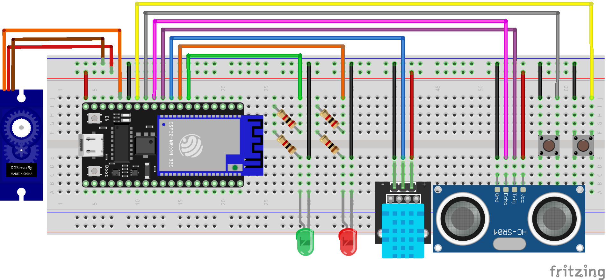

# 🏠 Room Control
Sistema di monitoraggio ambientale e controllo accessi basato su ESP32

---

## 📖 Descrizione

**Room Control** è un sistema embedded progettato per il monitoraggio delle condizioni ambientali di una stanza e la gestione degli accessi in modalità sicurezza.

Il progetto integra sensori, connettività Wi-Fi e servizi cloud per fornire:
- Monitoraggio in tempo reale di **temperatura** e **umidità**
- Rilevamento di **movimento/presenza**
- Invio di **notifiche tramite Telegram**
- Archiviazione dati e log su **database MySQL**

Il sistema è stato sviluppato con un approccio modulare, risultando facilmente estendibile e adattabile a diversi contesti applicativi.

---

## 👥 Autori

- Denise Bozza (VR471516)  
- Mattia Giarolo (VR487810)  
- Mattia Moretto (VR489092)  

---

## 🛠️ Architettura del Sistema

Il cuore del sistema è un microcontrollore **ESP32**, responsabile della gestione dei sensori, della comunicazione di rete e del controllo degli attuatori.

### Funzionalità principali
- Connessione Wi-Fi e comunicazione HTTP
- Integrazione con bot Telegram
- Invio dati a database remoto
- Controllo attuatori (servo, LED)

---

## 🔧 Componenti Hardware

### 📌 Schema del circuito


---

### 🔹 ESP32
Microcontrollore con Wi-Fi e Bluetooth integrati.

**Ruolo nel sistema:**
- Gestione logica centrale
- Comunicazione con servizi esterni
- Controllo sensori e attuatori

---

### 🌡️ Sensore DHT11
Sensore digitale per temperatura e umidità.

**Specifiche tecniche:**
- Temperatura: 0–50°C  
- Umidità: 20–90%  
- Precisione: ±2°C / ±5%  

---

### 📡 Sensore HC-SR04
Sensore a ultrasuoni per il rilevamento della distanza.

**Specifiche tecniche:**
- Range: 2–400 cm  
- Precisione: ~3 mm  

Utilizzato per rilevare movimenti o presenza in prossimità dell’ingresso.

---

### ⚙️ Servo Motore
Attuatore controllato tramite segnale PWM.

**Utilizzo:**
- Simulazione controllo luce o attivazione meccanismi

---

## ⚙️ Funzionamento

### 🔄 Flusso operativo

1. **Avvio del sistema**
   - Connessione alla rete Wi-Fi
   - Segnalazione stato tramite LED

2. **Modalità sicurezza**
   - Attivabile tramite pulsante o Telegram
   - Indicata da LED rosso

3. **Rilevamento movimento**
   - Modalità attiva:
     - Invio notifica Telegram
   - Modalità disattiva:
     - Attivazione servo motore

4. **Controllo manuale**
   - Pulsante per gestione LED di stato

---

## 🌐 Monitoraggio e Persistenza Dati

I dati rilevati dal sensore DHT11 vengono:
- Raccolti periodicamente
- Inviati tramite richieste HTTP
- Salvati su database MySQL

**Vantaggi:**
- Storico dati consultabile
- Possibilità di analisi e integrazione con dashboard

---

## 🤖 Integrazione Telegram

Il sistema utilizza un bot Telegram per:
- Notifiche in tempo reale di eventi
- Controllo remoto della modalità sicurezza

La comunicazione è bidirezionale.

---

## ⚠️ Limitazioni

- Il sensore HC-SR04 mostra affidabilità ottimale tra **100 cm e 200 cm**
- Possibili falsi positivi oltre tale distanza
- Il sistema non distingue tra ingresso e uscita (logica semplificata)

---

## 📁 Struttura del Progetto

Il codice è organizzato in modo modulare:
- Separazione per componenti (sensori, rete, logica)
- Facilità di manutenzione e sviluppo collaborativo

---

## 🔐 Configurazione

Per motivi di sicurezza, il file contenente le credenziali non è incluso nel repository.

Creare un file `secret.h` con le seguenti variabili:

```c
#define BOT_KEY ""
#define CHAT_ID ""
#define DB_APIKEY ""
#define DB_URL_API_REST ""
#define WIFI_SSID ""
#define WIFI_PASSWORD ""